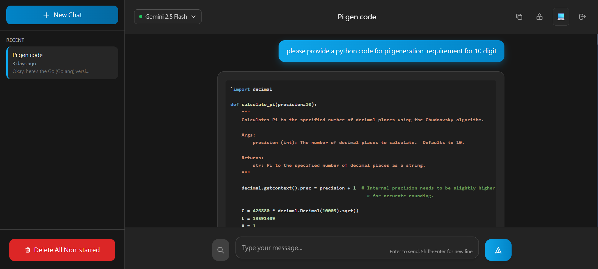

# ChatAI-GCP

A secure AI chat web application powered by Google Gemini, built with FastAPI and React.

## UI Overview



## 🚀 Phase 4 Complete - Production Deployed with End-to-End Encryption!

**Current Status:** Fully deployed production chat application with complete end-to-end AES encryption

✅ **Production Features:**
- **🔐 End-to-End AES-256-GCM Encryption**: All chat and conversation data encrypted
- **🌐 Live Production Deployment**: Running on Google App Engine
- **🤖 Real-time AI Chat**: Streaming responses from Google Gemini AI
- **⚡ Dynamic Model Selection**: Choose from 42+ available Gemini models with intelligent caching
- **🔒 Secure Authentication**: JWT-based single-user login with token refresh
- **🛡️ Protected Routes**: All chat and conversation endpoints require authentication
- **🎨 Modern UI**: React frontend with TailwindCSS and ChatGPT-inspired design
- **📁 Complete Conversation Management**: CRUD, starring, bulk delete, title editing
- **🔍 Google Search Grounding**: Web search integration with citations and references
- **🌐 URL Context Detection**: Automatic web page context grounding
- **🔐 Security Headers**: CSP, HSTS, XSS protection, and rate limiting
- **📝 Markdown Support**: Rich text rendering with syntax highlighting for code
- **📱 Responsive Design**: Mobile-friendly interface with secure login screen
- **⚡ Server-Sent Events**: Real-time streaming without polling (fully encrypted)
- **📘 TypeScript**: Full type safety throughout the application

## Architecture

- **Backend**: FastAPI (Python 3.13) with Google Gemini API
- **Authentication**: JWT tokens with refresh mechanism
- **Frontend**: React with TypeScript and TailwindCSS
- **Database**: Google Firestore Native
- **Security**: Rate limiting, security headers, protected endpoints
- **Deployment**: Google App Engine Standard
- **Streaming**: Server-Sent Events (SSE) for real-time AI responses

## Development Setup

### Prerequisites

- Python 3.13+
- Node.js 18+
- Google Cloud Project with Firestore and Gemini API enabled
- Google Gemini API key

## Quick Start

**Get the chat app running in 5 minutes:**

### 1. Backend Setup
```bash
cd backend
pip install -r requirements.txt

# Set up environment variables
cp .env.example .env
# Edit .env and configure:
# - GOOGLE_API_KEY: Your Gemini API key
# - JWT_SECRET_KEY: Generate with: python -c "import secrets; print(secrets.token_hex(32))"
# - USERNAME: Your login username (default: admin)
# - PASSWORD_HASH: SHA256 hash of your password (default hash is for "secret123")

# Start backend server
uvicorn main:app --reload
# Backend will be available at http://localhost:8000
```

### 2. Frontend Setup  
```bash
cd frontend
npm install

# Start frontend development server
npm start
# Frontend will be available at http://localhost:3000
```

### 3. Test the Secure Chat
1. Open `http://localhost:3000`
2. **Login** with default credentials:
   - Username: `admin`
   - Password: `secret123`
3. **Select a model** from the dropdown in the header (42+ available models)
4. Create a new conversation and type: "Hello, who are you?"
5. Watch the AI respond in real-time with your selected model!
6. Try starring conversations, editing titles, and bulk delete features

**⚠️ Security Note:** Change the default password hash in production! The default PASSWORD_HASH in `.env.example` corresponds to "secret123".

## Detailed Development Setup

### Backend Setup

1. **Install Python dependencies:**
   ```bash
   cd backend
   pip install -r requirements.txt
   ```

2. **Set up environment variables:**
   ```bash
   cp .env.example .env
   # Edit .env with your Google Cloud credentials
   ```

3. **Run the development server:**
   ```bash
   uvicorn main:app --reload
   ```

### Frontend Setup

1. **Install Node.js dependencies:**
   ```bash
   cd frontend
   npm install
   ```

2. **Start the development server:**
   ```bash
   npm start
   ```

3. **Run tests:**
   ```bash
   npm test
   ```

4. **Build for production:**
   ```bash
   npm run build
   ```

## Environment Variables

Create a `.env` file in the backend directory:

```env
# Required for Phase 2
GOOGLE_API_KEY=your_gemini_api_key
GOOGLE_CLOUD_PROJECT=your_gcp_project_id
DEBUG=true

# Optional for Phase 2
FIRESTORE_DATABASE=(default)
```

## API Endpoints

### Chat Endpoints
- `POST /api/chat/` - Start new conversation with streaming response
- `POST /api/chat/{conversation_id}` - Continue existing conversation

### Conversation Management
- `GET /api/conversations` - List all conversations
- `GET /api/conversations/{id}` - Get conversation details
- `POST /api/conversations/{id}/star` - Star/unstar conversation
- `DELETE /api/conversations/{id}` - Delete conversation
- `DELETE /api/conversations/nonstarred` - Bulk delete non-starred

### Utility
- `GET /health` - Health check endpoint
- `GET /` - API status

## Features

### ✅ Completed Features (All Phases)
- ✅ **Phase 1**: Complete design and architecture documentation
- ✅ **Phase 2**: Real-time streaming AI chat with conversation management
- ✅ **Phase 3**: JWT authentication, protected endpoints, secure session management
- ✅ **Phase 4**: End-to-end AES-256-GCM encryption with production deployment

### 🚀 Production Deployment
- ✅ Google App Engine deployment
- ✅ Environment variables configuration
- ✅ Frontend/backend integration
- ✅ SSL/HTTPS security
- ✅ Auto-scaling infrastructure

## Deployment

### Google App Engine

1. **Configure app.yaml:**
   - Update environment variables in `app.yaml`
   - Set your Google Cloud project ID

2. **Deploy:**
   ```bash
   gcloud app deploy
   ```

3. **Set environment variables in GCP Console:**
   - Navigate to App Engine → Settings → Environment Variables
   - Add required environment variables

## Development Guidelines

### Code Style
- Backend: Black formatter, isort for imports
- Frontend: Prettier, ESLint with TypeScript rules
- Use type hints in Python and TypeScript interfaces

### Testing
- Backend: pytest with >80% coverage target
- Frontend: React Testing Library with Jest
- Integration tests for API endpoints

### Security
- No secrets in code or commits
- Environment variables for all sensitive data
- HTTPS enforced in production
- CORS properly configured

## Project Structure

```
chatai-gcp/
├── backend/                 # FastAPI backend
│   ├── main.py             # Main FastAPI application
│   ├── config.py           # Configuration management
│   ├── models.py           # Pydantic models
│   ├── routers/            # API route handlers
│   ├── services/           # Business logic services
│   └── tests/              # Backend tests
├── frontend/               # React frontend
│   ├── src/
│   │   ├── components/     # React components
│   │   ├── services/       # API service layer
│   │   ├── types/          # TypeScript interfaces
│   │   └── App.tsx         # Main app component
│   └── public/             # Static assets
├── app.yaml                # Google App Engine config
├── DESIGN.md              # Detailed system design
├── API.md                 # API specification
├── PLAN.md                # Development plan
└── CLAUDE.md              # Development guidance
```

## Contributing

1. Create feature branch from `master`
2. Implement changes with tests
3. Run full test suite
4. Submit for code review
5. Deploy after approval

## License

Private project - All rights reserved.
